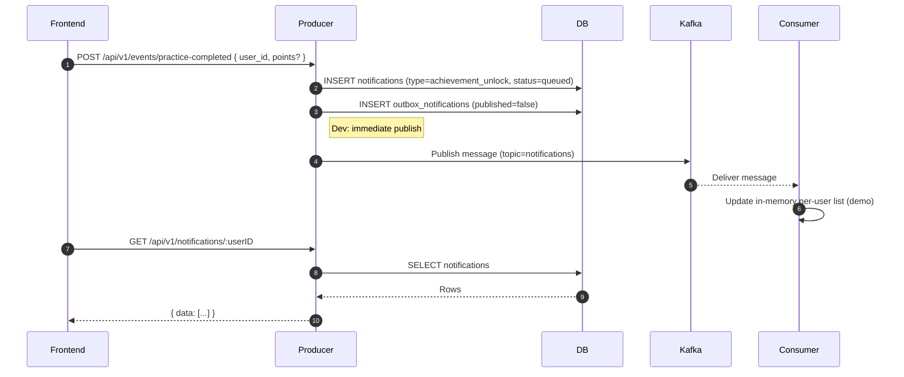
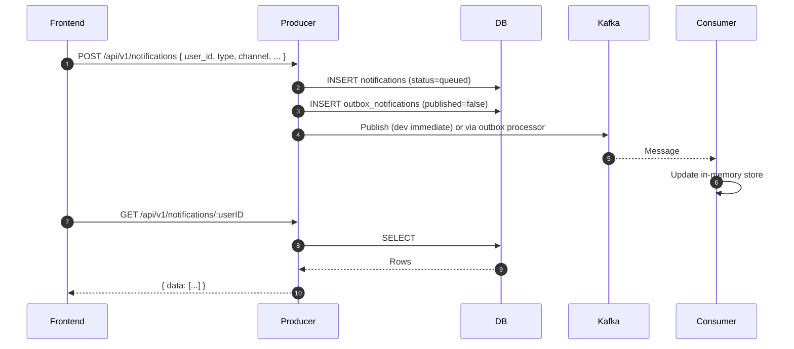
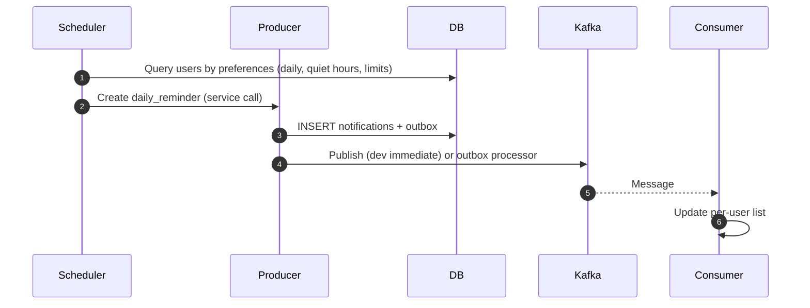
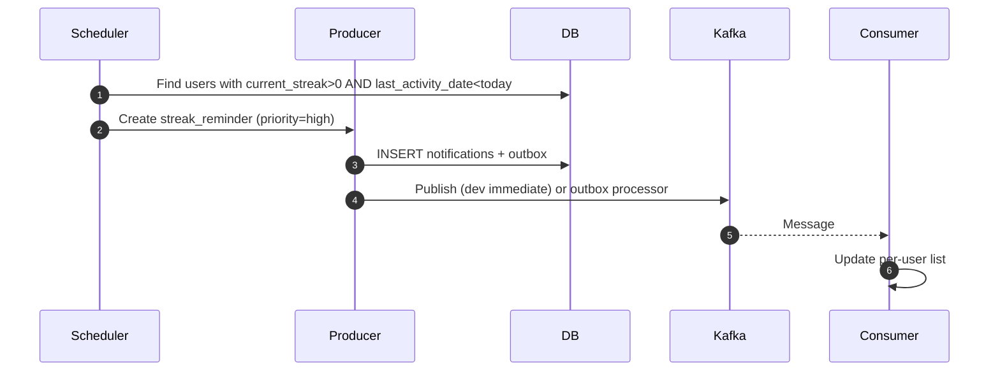
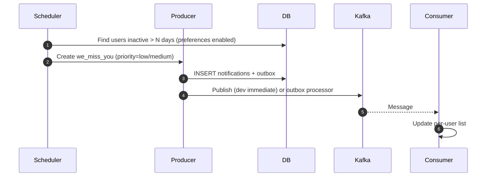
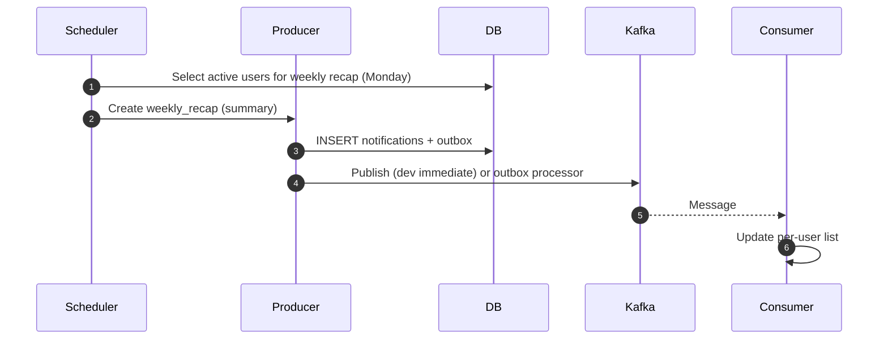

### Notification Flows (Triggers → Delivery)

This document visualizes how a trigger becomes a user-visible notification without WebSockets. UI refreshes via HTTP reads.

Legend
- Frontend: React app (Vite :3000)
- Producer: API service (:8082)
- DB: Postgres (:5432)
- Kafka: Broker (:9092)
- Consumer: Consumer service (:8081, demo in-memory store)

### 1) Event-Driven: Practice Completed → Achievement


Implementation snippets

```go
// backend/cmd/producer/main.go
api.POST("/events/practice-completed", handlers.PracticeCompleted)

// backend/pkg/handlers/notification_handlers.go
func (h *NotificationHandlers) PracticeCompleted(c *gin.Context) {
    var req struct{ UserID uuid.UUID `json:"user_id"` }
    _ = c.ShouldBindJSON(&req)
    newReq := &models.CreateNotificationRequest{
        UserID: req.UserID,
        Type:   models.AchievementUnlock,
        Channel: models.ChannelInApp,
    }
    _, _ = h.notificationService.CreateNotification(c.Request.Context(), newReq)
}
```

### 2) Manual Create: API → Any Notification Type


Implementation snippets

```go
// backend/cmd/producer/main.go
api.POST("/notifications", handlers.CreateNotification)
api.GET("/notifications/:userID", handlers.GetUserNotifications)
api.PUT("/notifications/:id/read", handlers.MarkAsRead)

// backend/pkg/handlers/notification_handlers.go
func (h *NotificationHandlers) CreateNotification(c *gin.Context) {
    var req models.CreateNotificationRequest
    _ = c.ShouldBindJSON(&req)
    n, _ := h.notificationService.CreateNotification(c.Request.Context(), &req)
    c.JSON(http.StatusCreated, gin.H{"data": n})
}
```

### 3) Scheduled: Daily Reminder


Implementation snippets

```go
// backend/cmd/scheduler/scheduler.go
go s.startDailyReminderScheduler()

func (s *SchedulerService) processDailyReminders() error {
    ctx := context.Background()
    users, _ := s.getUsersNeedingDailyReminders(ctx)
    for _, u := range users { _ = s.createDailyReminder(ctx, u) }
    return nil
}

func (s *SchedulerService) createDailyReminder(ctx context.Context, user models.User) error {
    n := &models.Notification{Type: models.DailyReminder, Channel: models.ChannelInApp}
    return s.repository.CreateNotification(ctx, n)
}
```

### 4) Scheduled: Streak Reminder (At-Risk)


Implementation snippets

```go
// backend/cmd/scheduler/scheduler.go
go s.startStreakReminderScheduler()

func (s *SchedulerService) processStreakReminders() error {
    ctx := context.Background()
    users, _ := s.getUsersNeedingStreakReminders(ctx)
    for _, u := range users { _ = s.createStreakReminder(ctx, u) }
    return nil
}

func (s *SchedulerService) createStreakReminder(ctx context.Context, user models.User) error {
    n := &models.Notification{Type: models.StreakReminder, Channel: models.ChannelInApp}
    return s.repository.CreateNotification(ctx, n)
}
```

### 5) Scheduled: We Miss You (Inactivity)


Implementation snippets

```go
// backend/cmd/scheduler/scheduler.go
go s.startEngagementNudgeScheduler()

func (s *SchedulerService) processEngagementNudges() error {
    ctx := context.Background()
    users, _ := s.getInactiveUsersForEngagementNudge(ctx)
    for _, u := range users { _ = s.createEngagementNudge(ctx, u) }
    return nil
}

func (s *SchedulerService) createEngagementNudge(ctx context.Context, user models.User) error {
    n := &models.Notification{Type: models.WeMissYou, Channel: models.ChannelInApp}
    return s.repository.CreateNotification(ctx, n)
}
```

### 6) Scheduled: Weekly Recap (Mondays)


Implementation snippets

```go
// backend/cmd/scheduler/scheduler.go
go s.startWeeklyRecapScheduler()

func (s *SchedulerService) processWeeklyRecaps() error {
    if time.Now().Weekday() != time.Monday { return nil }
    ctx := context.Background()
    users, _ := s.getActiveUsersForWeeklyRecap(ctx)
    for _, u := range users { _ = s.createWeeklyRecap(ctx, u) }
    return nil
}

func (s *SchedulerService) createWeeklyRecap(ctx context.Context, user models.User) error {
    n := &models.Notification{Type: models.WeeklyRecap, Channel: models.ChannelInApp}
    return s.repository.CreateNotification(ctx, n)
}
```

Notes
- In dev, Producer publishes immediately after outbox insert to minimize latency.
- In prod, prefer background outbox processing, retries, and DLQ.
- Frontend surfaces updates via HTTP polling (`GET /api/v1/notifications/:userID`).


