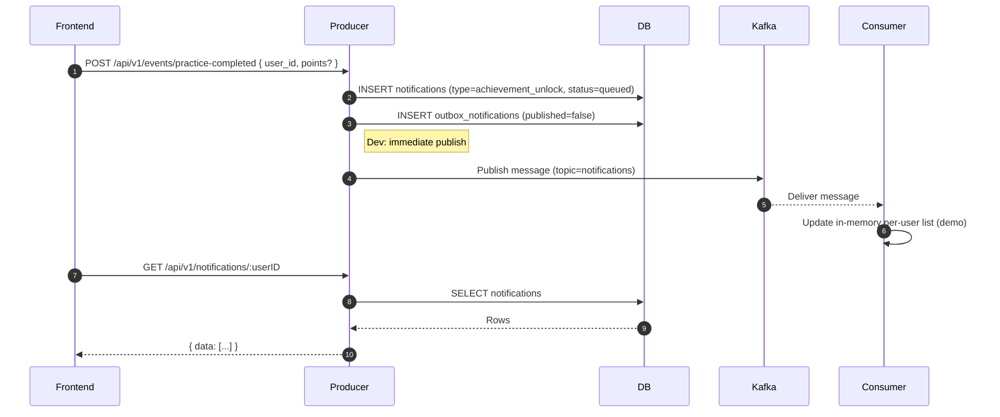
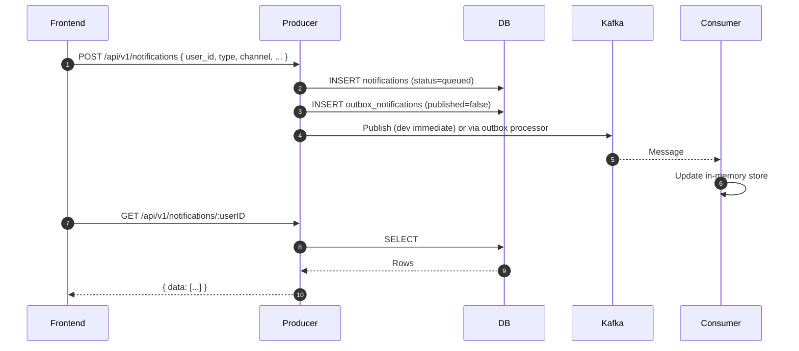
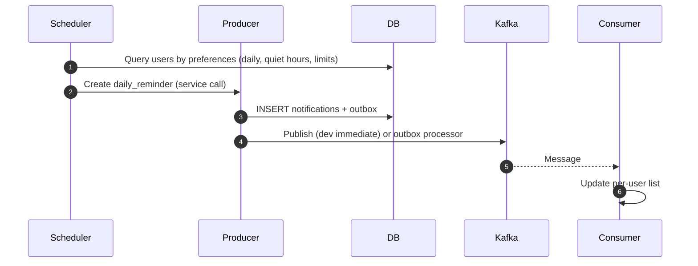
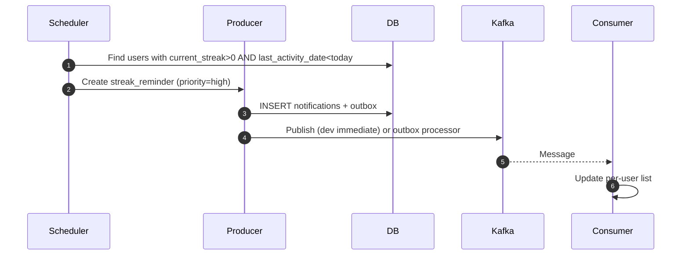
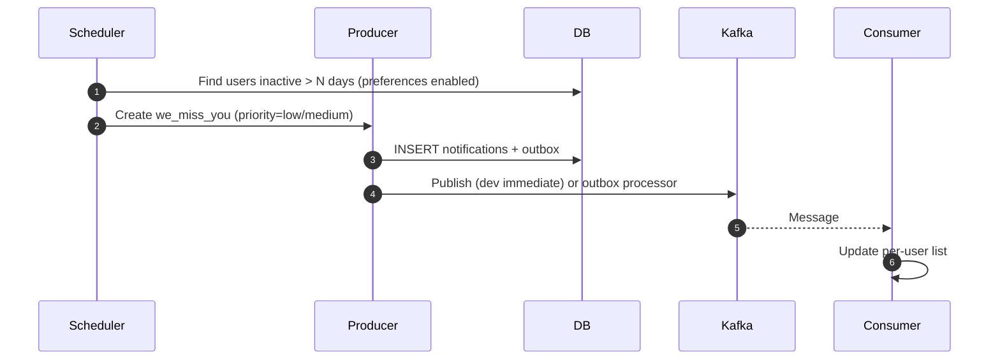
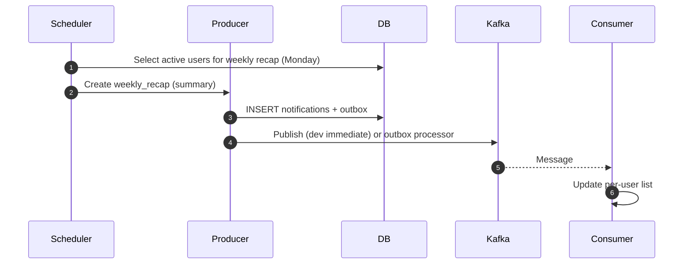

# Notification System

A comprehensive notification system built with **Go backend** and **React frontend**, featuring Apache Kafka for event streaming and PostgreSQL for data persistence. Real-time push via WebSockets is not implemented; the UI fetches updates via HTTP.

## 🏗️ Project Structure

```
├── backend/                    # Go backend services
│   ├── cmd/                   # Service entry points
│   ├── internal/              # Private application code
│   ├── pkg/                   # Public packages
│   ├── configs/               # Configuration files
│   └── Makefile               # Build & development tasks
├── frontend/                   # React frontend application
│   ├── src/components/         # React components
│   ├── src/hooks/             # Custom React hooks
│   └── src/utils/              # Utility functions
├── Notifications-Plan/         # Project planning & documentation
├── docker-compose.yml          # Infrastructure setup
└── README.md                   # This file
```

## 🚀 Quick Start

### 1. Start Infrastructure

```bash
# Start Kafka and dependencies
docker-compose up -d
```

### 2. Backend Services

```bash
# Navigate to backend directory
cd backend

# Setup environment
cp configs/env.example .env
# Edit .env with your settings

# Install dependencies and build
make deps
make build

# Run services (in separate terminals)
make run-producer    # Port 8082
make run-consumer    # Kafka consumer
make run-scheduler   # Automated notifications
```

### 3. Frontend Application

```bash
# Navigate to frontend directory
cd frontend

# Install dependencies
npm install

# Start development server
npm run dev
```

## 🎯 Features

### Backend Services
- **Producer Service**: HTTP API for notification management with outbox pattern
- **Consumer Service**: Kafka consumer with retry logic and dead letter queues
- **Scheduler Service**: Automated notification generation (daily reminders, streaks)
- **Delivery**: HTTP-based reads/polling (WebSocket push removed)
- **Database Integration**: PostgreSQL with connection pooling and health checks

### Frontend Components
- **Notification Center**: Real-time notification display and management
- **Engagement Dashboard**: Streak tracking and progress visualization
- **Preferences Management**: User notification settings and quiet hours
- **Updates**: HTTP fetches to refresh notifications (no WebSocket push)
- **Responsive Design**: Mobile-first UI with Tailwind CSS

### Infrastructure
- **Apache Kafka**: Event streaming and message queuing
- **PostgreSQL**: Primary data storage with Supabase integration
- **Docker**: Containerized development environment
- **Health Monitoring**: Built-in health checks and metrics

## 🛠️ Technology Stack

### Backend
- **Go 1.21+**: High-performance backend services
- **Gin**: HTTP web framework
- **Sarama**: Kafka client library
- **PostgreSQL**: Database with connection pooling
- **UUID**: Unique identifier generation

### Frontend
- **React 18**: Modern UI framework
- **TypeScript**: Type-safe development
- **Vite**: Fast build tool
- **Tailwind CSS**: Utility-first styling
  
Note: WebSocket real-time communication is not currently implemented in this project.

### Infrastructure
- **Apache Kafka**: Message broker
- **Docker Compose**: Local development setup
- **PostgreSQL**: Database
- **Redis**: Caching (planned)

## 📡 API Endpoints

### Producer Service (Port 8082)

| Method | Endpoint | Description |
|--------|----------|-------------|
| `GET` | `/health` | Health check |
| `POST` | `/api/v1/notifications` | Create notification |
| `GET` | `/api/v1/notifications/:userID` | Get user notifications |
| `PUT` | `/api/v1/notifications/:id/read` | Mark as read |
| `PUT` | `/api/v1/preferences/:userID` | Update preferences |
| `GET` | `/api/v1/preferences/:userID` | Get preferences |
| `POST` | `/api/v1/reminders/daily` | Create daily reminder |
| `POST` | `/api/v1/reminders/streak` | Create streak reminder |

## 🗄️ Database Schema

The system uses a comprehensive database schema including:

- **Users**: Profile information and preferences
- **Notifications**: Notification records with delivery status
- **Preferences**: User notification settings
- **Engagement**: Streak tracking and user activity
- **Outbox**: Reliable message delivery pattern
- **Templates**: Reusable notification content

## 🔧 Development

### Backend Development

```bash
cd backend

# Run tests
make test

# Run linter
make lint

# Format code
make fmt

# Build production binaries
make build-prod
```

### Frontend Development

```bash
cd frontend

# Run tests
npm test

# Build for production
npm run build

# Preview production build
npm run preview
```

### Infrastructure Management

```bash
# Start services
docker-compose up -d

# View logs
docker-compose logs -f

# Stop services
docker-compose down
```

## 📊 Monitoring & Health Checks

- **Health Endpoints**: `/health` for each service
- **Database Monitoring**: Connection pooling and health checks
- **Kafka Connectivity**: Producer and consumer health monitoring
- **Request Logging**: Structured logging with correlation IDs
- **Graceful Shutdown**: Proper cleanup and resource management

## 🚀 Deployment

### Backend Deployment

```bash
cd backend

# Build production binaries
make build-prod

# The binaries are ready for deployment
# Copy to your server and run with appropriate configuration
```

### Frontend Deployment

```bash
cd frontend

# Build production bundle
npm run build

# Deploy the dist/ folder to your web server
```

### Docker Deployment

```bash
# Build and run with Docker Compose
docker-compose -f docker-compose.prod.yml up -d
```

## 🔍 Troubleshooting

### Common Issues

1. **Port Conflicts**: Ensure ports 8082 (backend) and 3000 (frontend) are available
2. **Kafka Connection**: Verify Kafka is running with `docker-compose ps`
3. **Database Connection**: Check PostgreSQL connection settings in `.env`
4. **Import Errors**: Run `make deps` in backend directory

### Debug Mode

```bash
# Backend debug
export LOG_LEVEL=debug
export GIN_MODE=debug

# Frontend debug
# Check browser console and network tab
```

## 📚 Documentation

- **[Backend Documentation](./backend/README.md)**: Detailed backend service documentation
- **[Frontend Documentation](./frontend/README.md)**: React component and hook documentation
- **[Implementation Plan](./Notifications-Plan/implementation-plan.md)**: Project roadmap and features
- **[Database Schema](./Notifications-Plan/Data-Model-Notif.md)**: Database design documentation


### 1) Event-Driven: Practice Completed → Achievement


Implementation snippets

```go
// backend/cmd/producer/main.go
api.POST("/events/practice-completed", handlers.PracticeCompleted)

// backend/pkg/handlers/notification_handlers.go
func (h *NotificationHandlers) PracticeCompleted(c *gin.Context) {
    var req struct{ UserID uuid.UUID `json:"user_id"` }
    _ = c.ShouldBindJSON(&req)
    newReq := &models.CreateNotificationRequest{
        UserID: req.UserID,
        Type:   models.AchievementUnlock,
        Channel: models.ChannelInApp,
    }
    _, _ = h.notificationService.CreateNotification(c.Request.Context(), newReq)
}
```

### 2) Manual Create: API → Any Notification Type


Implementation snippets

```go
// backend/cmd/producer/main.go
api.POST("/notifications", handlers.CreateNotification)
api.GET("/notifications/:userID", handlers.GetUserNotifications)
api.PUT("/notifications/:id/read", handlers.MarkAsRead)

// backend/pkg/handlers/notification_handlers.go
func (h *NotificationHandlers) CreateNotification(c *gin.Context) {
    var req models.CreateNotificationRequest
    _ = c.ShouldBindJSON(&req)
    n, _ := h.notificationService.CreateNotification(c.Request.Context(), &req)
    c.JSON(http.StatusCreated, gin.H{"data": n})
}
```

### 3) Scheduled: Daily Reminder


Implementation snippets

```go
// backend/cmd/scheduler/scheduler.go
go s.startDailyReminderScheduler()

func (s *SchedulerService) processDailyReminders() error {
    ctx := context.Background()
    users, _ := s.getUsersNeedingDailyReminders(ctx)
    for _, u := range users { _ = s.createDailyReminder(ctx, u) }
    return nil
}

func (s *SchedulerService) createDailyReminder(ctx context.Context, user models.User) error {
    n := &models.Notification{Type: models.DailyReminder, Channel: models.ChannelInApp}
    return s.repository.CreateNotification(ctx, n)
}
```

### 4) Scheduled: Streak Reminder (At-Risk)


Implementation snippets

```go
// backend/cmd/scheduler/scheduler.go
go s.startStreakReminderScheduler()

func (s *SchedulerService) processStreakReminders() error {
    ctx := context.Background()
    users, _ := s.getUsersNeedingStreakReminders(ctx)
    for _, u := range users { _ = s.createStreakReminder(ctx, u) }
    return nil
}

func (s *SchedulerService) createStreakReminder(ctx context.Context, user models.User) error {
    n := &models.Notification{Type: models.StreakReminder, Channel: models.ChannelInApp}
    return s.repository.CreateNotification(ctx, n)
}
```

### 5) Scheduled: We Miss You (Inactivity)


Implementation snippets

```go
// backend/cmd/scheduler/scheduler.go
go s.startEngagementNudgeScheduler()

func (s *SchedulerService) processEngagementNudges() error {
    ctx := context.Background()
    users, _ := s.getInactiveUsersForEngagementNudge(ctx)
    for _, u := range users { _ = s.createEngagementNudge(ctx, u) }
    return nil
}

func (s *SchedulerService) createEngagementNudge(ctx context.Context, user models.User) error {
    n := &models.Notification{Type: models.WeMissYou, Channel: models.ChannelInApp}
    return s.repository.CreateNotification(ctx, n)
}
```

### 6) Scheduled: Weekly Recap (Mondays)


Implementation snippets

```go
// backend/cmd/scheduler/scheduler.go
go s.startWeeklyRecapScheduler()

func (s *SchedulerService) processWeeklyRecaps() error {
    if time.Now().Weekday() != time.Monday { return nil }
    ctx := context.Background()
    users, _ := s.getActiveUsersForWeeklyRecap(ctx)
    for _, u := range users { _ = s.createWeeklyRecap(ctx, u) }
    return nil
}

func (s *SchedulerService) createWeeklyRecap(ctx context.Context, user models.User) error {
    n := &models.Notification{Type: models.WeeklyRecap, Channel: models.ChannelInApp}
    return s.repository.CreateNotification(ctx, n)
}
```


## 🤝 Contributing

1. Fork the repository
2. Create a feature branch
3. Follow the coding standards
4. Add tests for new functionality
5. Submit a pull request

## 📄 License

This project is licensed under the MIT License.

## 🆘 Support

For questions and support:
- Check the documentation in each directory
- Review the troubleshooting section
- Open an issue on GitHub

---

**Built with ❤️ using Go, React, and Apache Kafka**
